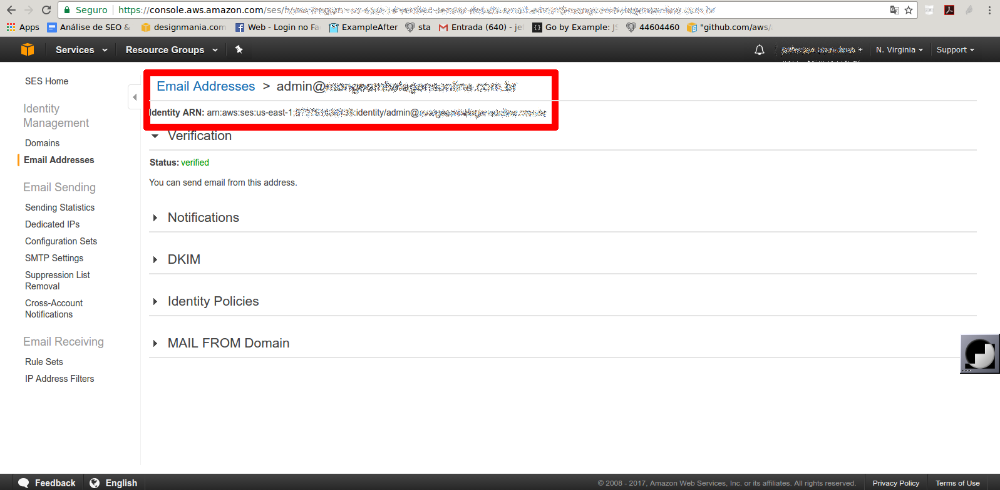

# gses

A package to send emails using AWS SES, a package to facilitate its abstraction using the SES GO SDK.

In order for your email to be sent successfully using the aws sdk you need to have an email validated by SES (Verify This Email Address), console access can be done by clicking here https://console.aws.amazon.com/ses, it will Also need your Identity ARN.

#### Verify This Email Address - SES Example



We only need to configure your keys beforehand so that AWS SES works correctly.

- export AWS_REGION="aws-region"
- export AWS_IDENTITY="aws-identity"
- export AWS_ACCESS_KEY_ID="aws-access-key-id"
- export AWS_SECRET_ACCESS_KEY="aws-secret-access-key"

The parameters you should use are:

 - MsgHTML := `<h1>Test send Email</h1>`
 - To :="your-email-here@email.com"
 - From :="noreply@yourserver.com"
 - FromMsg :="Message in email"
 - Title :="Your Title Here"

```go

package main

import (
	"fmt"

	ses "github.com/jeffotoni/gses"
)

func main() {
	cfg := config.FromFile(".")

	ses := ses.NewSesEmail(cfg)

	defaultProfile := "default"
	// profile0 := "profile0"

	profile, err := ses.AddProfile(
		defaultProfile,
		cfg.AwsRegion,
		cfg.AwsIdentity,
		cfg.AwsFrom,
		cfg.AwsInfo,
	)

	if err != nil {
		log.Fatal(err)
	}

	_ = profile

	htmlBody := `<h1>Hello World</h1>`

	data := models.NewDataEmail(
		"to",
		"from",
		"message",
		"title",
		htmlBody,
		"bccAddress",
		"ccAddress",
	)

	if err := ses.SendEmailSes(defaultProfile, data); err != nil {
		log.Fatal(err)
	}

}

```